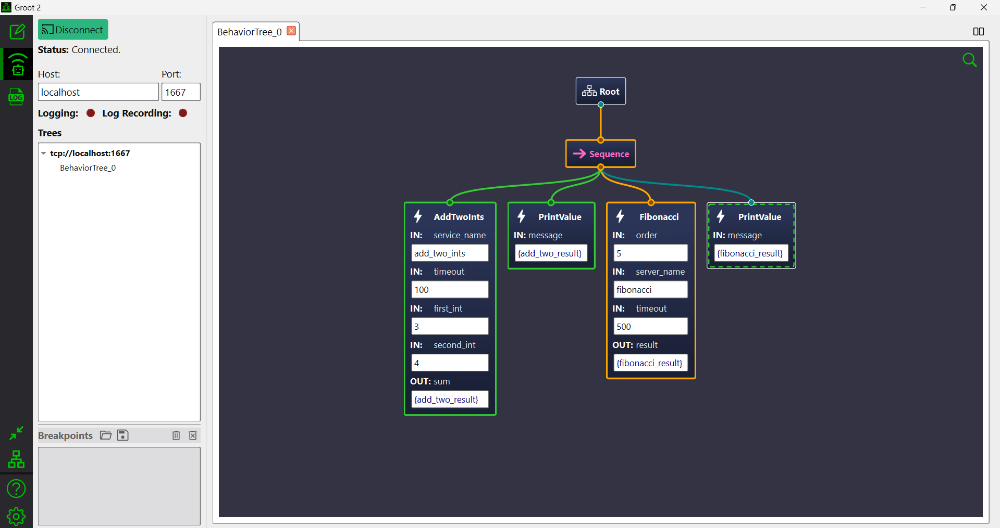

# Tutorial 4: Writing BT, visualisation and logging

**Table of Contents**

- [Code template](#code-template)
- [Explanation](#explanation)
- [Real-time visualisation with Groot2](#real-time-visualisation-with-groot2)
- [Logging a BT tree](#logging-a-bt-tree)
- [Running the entire example](#running-the-entire-example)
- [Workflow for writing a complex BT](#workflow-for-writing-a-complex-bt)

### Code template

```cpp
#include "custom_service.h"
#include "custom_action.h"
#include "random_function.h"
#include <ros/ros.h>
#include <behaviortree_cpp/loggers/groot2_publisher.h>
#include <behaviortree_cpp/behavior_tree.h>
#include <behaviortree_cpp/loggers/bt_file_logger_v2.h>
using namespace BT;

// headers for signal handling
#include <unistd.h>
#include <stdio.h>
#include <signal.h>

volatile sig_atomic_t stop;
void inthand(int signum) {
    stop = 1;
}

int main(int argc, char **argv) 
{
    ros::init(argc, argv, "test_behavior_tree");
    ros::NodeHandle nh;

    BehaviorTreeFactory factory;

    factory.registerNodeType<random_function>("Name");
    RegisterRosService<YourSericeClass>(factory, "ServiceName", nh);
    RegisterRosAction<YourActionClass>(factory, "ActionName", nh);

    // Create BT tree from xml file
    std::string xml_file;
    ros::param::get("~xml_file", xml_file);
    auto tree = factory.createTreeFromFile(xml_file);

    // Create a bt logger after creating the tree. The extension must be '.btlog'
    std::string log_file;
    ros::param::get("~log_file", log_file);
    FileLogger2 logger(tree, log_file);

    // Connect the Groot2Publisher. This will allow Groot2 to get the tree and poll status updates.
    const unsigned port = 1667;
    Groot2Publisher publisher(tree, port);

    NodeStatus status = tree.tickOnce();

    signal(SIGINT, inthand);

    while( !stop && ros::ok() && (status == NodeStatus::RUNNING))
    {
        ros::spinOnce();
        status = tree.tickOnce();
        tree.sleep(std::chrono::milliseconds(100));
    }
    std::cout << status << std::endl;
    return 0;
}
```

### Explanation

The code is more or less self-explanatory. If you have read the tutorials in the official docs, this should be easy to understand.

A few notes:

- `tickOnce()` is the preferred method over `tickWhileRunning()` because it allows us to implement our custom loop.

- `tree.sleep()` is necessary to avoid a busy loop. It is also much preferred over `std::this_thread::sleep_for()` because it allows the tree to be interrupted by an external event.

- When writing executables like C++, you should put all arguments and variables which are changed at runtime in either the ROS parameter server or the XML file. Here, we are using `ros::param::get("~xml_file", xml_file)` to get the path to the XML file from the parameter server. (You might see people use `nh.getParam()` instead of `ros::param::get()`, but apparently for private parameters, `ros::param::get()` is preferred.)

- If your custom BT action node or service node *header files* are defined inside the `src` dir (as is the case with this example repo because all of these classes are simple enough and do not need a separate .cpp file for elaborate implementation), you need to include the header files with "" instead of <>. However, if the header files are stored inside the `include` dir, you should use `<your_package/custom_header.h>`. No special modification of the `CMakeLists.txt` is required, however do remember to add the executable. Refer to the `CMakeLists.txt` in this repo for an example.

- You are recommended to implement the `SIGINT` handler to properly exit the programme and halt any ongoing actions. The implementation is inspired by this [StackOverflow answer](https://stackoverflow.com/questions/26965508/infinite-while-loop-and-control-c).

### Real-time visualisation with Groot2

Connecting to Groot2 is as simple as adding the following lines to your `main()` function:

```cpp
#include <behaviortree_cpp/loggers/groot2_publisher.h>

int main(int argc, char **argv) 
{
    // Your initialization code here

    // Connect the Groot2Publisher. This will allow Groot2 to get the tree and poll status updates.
    const unsigned port = 1667;
    Groot2Publisher publisher(tree, port);

}
```

Proceed to [download Groot2](https://www.behaviortree.dev/groot), available only for Windows and Linux users. If you are using WSL2 or Docker on Windows, please proceed to download the Windows version.

Upon opening Groot2, you will see on the top left corner the following tabs:

- `Editor mode`: create your BT tree with the GUI.

- `Real-time monitor mode`: this is where you can connect to the ip address and port of the Groot2Publisher. Thus, you can monitor the status of a BT tree deployed on a robot from your own computer in real-time.

- `Log viewer mode`: this is where you can replay the logs of the BT tree.

At the bottom left corner:

- `Compact mode`: compact representation of the BT tree, with ports and sub-trees hidden.

- `Toggle orientation of the tree`: toggle between vertical and horizontal orientation of the tree.

### Logging a BT tree

```cpp
// Other includes
#include <behaviortree_cpp/loggers/bt_file_logger_v2.h>

int main(int argc, char **argv) 
{
    // Register ROS
    // Register BT nodes
    // Create BT tree from xml file

    // Create a bt logger after creating the tree
    std::string log_file;
    ros::param::get("~log_file", log_file);
    FileLogger2 logger(tree, log_file);

    // Move on to running the tree
}

```

Using this snippet of code, you can log the BT tree to a file which must be of extension `.btlog`. You can replay the file in Groot2.

### Running the entire example

```bash
# open one terminal
roslaunch behaviortree_ros example_server.launch

# open another terminal
roslaunch behaviortree_ros example_bt.launch
```

Open Groot2 and connect to port 1667. If setup correctly, you should be able to see the following screen.



### Workflow for writing a complex BT

You shoudld *avoid* writing any of the XML files yourself; editing XML file with an editor is only for small details. Instead, here is the suggested workflow:

1. Create a `TreeNodeModels` XML file using a .cpp script. This is required by Groot2 in order to add custom nodes and create a BT from GUI.

2. Import the `TreeNodeModels` XML file into Groot2 and start creating your BT.

3. Save the BT as a .xml file. This file will contain all the logic and explicit tree node models so that you can edit it with Groot2 in the future.

for step 1, you can write a .cpp script, let's name it `generate_tree_node_model.cpp` in the `scripts` directory of your ros package. Here is an example code:

```cpp
// assuming this .cpp file is in the scripts folder
// #include "../src/custom_node.h" if the header file is in the src folder
// #include <your_package/custom_node.h> if the header file is in the include folder
#include <ros/ros.h>
#include <behaviortree_cpp/xml_parsing.h>
using namespace BT;

// headers for writing and file operation
#include <iostream>
#include <fstream>

int main(int argc, char **argv) 
{
    ros::init(argc, argv, "generate_tree_node_model");
    ros::NodeHandle nh;

    BehaviorTreeFactory factory;

    // ----------------- Register your custom nodes ----------------------


    // Add your xml_file_path here
    std::string xml_file_path;
    ros::param::get("~tree_node_model_xmlfile_path", xml_file_path);

    std::ofstream out(xml_file_path);
    out << BT::writeTreeNodesModelXML(factory);
    out.close();
    
    return 0;
}
```

Remember to add the following to your CMakelists.txt:

```cmake
add_executable(generate_tree_node_model scripts/generate_tree_node_model.cpp)
add_dependencies(generate_tree_node_model ${${PROJECT_NAME}_EXPORTED_TARGETS} ${catkin_EXPORTED_TARGETS})
target_link_libraries(generate_tree_node_model ${catkin_LIBRARIES} )
```

And of course write the .launch file with this parameter `tree_node_model_xmlfile_path`.

Run your script as usual:

```bash
cd ~/catkin_ws
catkin_make
roslaunch your_package generate_tree_node_model.launch
```

